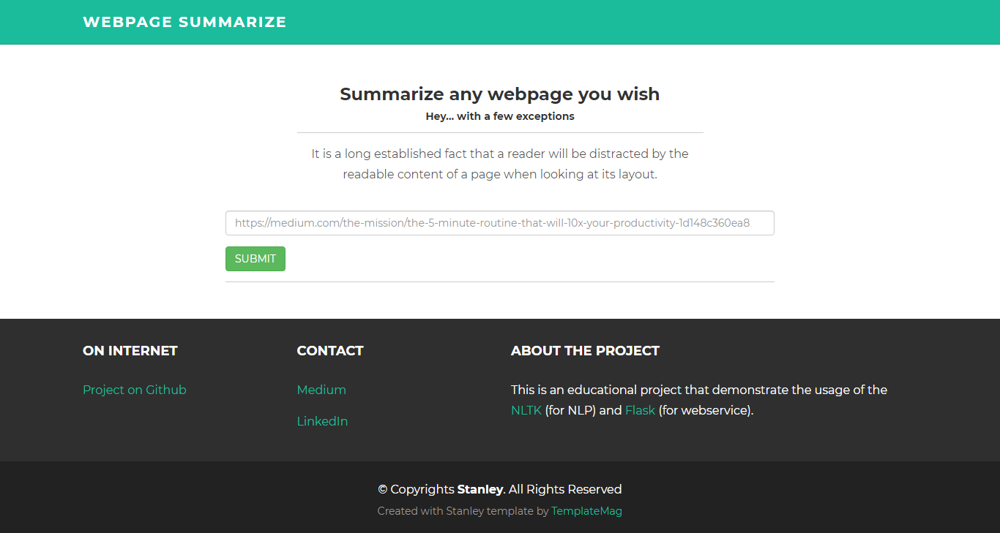
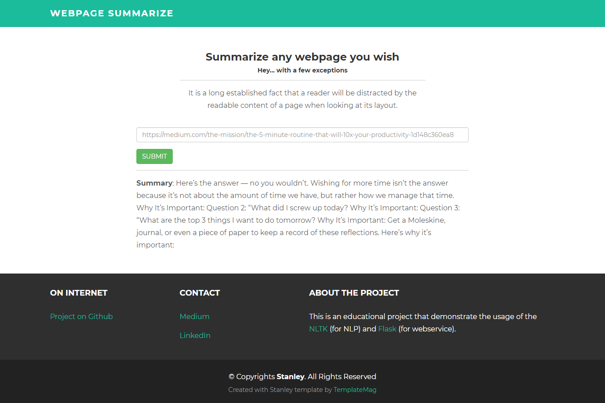

# Summarize-Webpage, Powered by [nlp-akash](https://github.com/akashp1712/nlp-akash).

## A Flask application that extract and summarize webpage using Natural Language Processing.

<p align="center">

<p>

# Index

* [Motivation](#motivation)
* [How to start](#how-to-start)
* [Requirements](#requirements)
* [Implementation](#implementation)
* [Contribution](#contribution)
* [Ideas](#ideas)
* [Credits](#credits)

## Motivation

Motivation of this project to make production ready API for **Text Summarization Algorithm** and leverage it for the real-world use cases. This project implements a NLP algorithm using Python and serves using flask API.

## How to start

You need to manually clone or download this repository. Project is ready to run (with some requirements).

You need to run ```app.py``` file in your development environment.

>Open http://127.0.0.1:5000/, customize project files and **have fun**.

## Requirements

The suggested way is to use ```python virtual environment```. The project is developed using ```python 3.7.1```

### Included modules support

#### Python
This project uses very simple <b>python web framework called [Flask](http://flask.pocoo.org/)</b>, which is very easy to learn and adopt. (even scale!!!)

The <b>[NLTK](https://www.nltk.org) - Natural Language ToolKit</b> is used for the Text Summarization Algorithm implementation.

#### HTML

The HTML Template used in this project is <b>[Stanley](https://templatemag.com/stanley-bootstrap-freelancer-template/) - Bootstrap Freelancer Template</b>.

#### JavaScript

- Vanilla Javascript

#### CSS

- Vanilla CSS

#### Installation
Run requirements.txt to install the required python packages.

```
$ pip install -r requirements.txt
```
---
## Implementation

#### Project Structure 
```
|───config/
|───framework/
|───implementaion/
|───static/
|───templates/
|───app.py
|───wsgi.py
```


----
#### Framework
    ├──framework
    | |──justext
    | |──parser


 > jusText (the original framework) is developed by [`miso-belica`](https://github.com/miso-belica)

- ``justext`` is modified code from [`jusText`](https://github.com/miso-belica/jusText) which is a Heuristic based boilerplate removal tool.
 The original code is modified to parse some of the tags ``(i.e, <P>, <li>, <b>, <H1>...<H6>), etc``
 
    - Please note that, this project only uses English stopwords from the original project.
 
 
- We're using jusText framework to download the webcontent and parse it using ``parser``.

  - ``parser`` creates list of ``Paragraph`` object which has following properties:
  
    
```
1. is_heading -> boolean
   :: returns true if paragraph is heading (<H1>...<H6>) 


2. is_list_set -> boolean 
   :: returns true if paragraph is list tag (<li>)


3. is_paragraph -> boolean
   :: returns true if paragraph is paragraph tag (<p>)

4. is_first_paragraph(self):
   :: returns true if the paragraph is the first paragraph from the content.

5. text(self):
   :: get the text content of the paragraph without any tags
```
---
#### Summarization Algorithm
    ├──implementaion
    | |──word_frequency_summarize_parser.py
    
  This is the core module of this project: The implementation of the Summarization Algorithm.
  
[**Word_Frequency_Summarization:**](https://github.com/akashp1712/nlp-akash/blob/master/text-summarization/Word_Frequency_Summarization.py) Summarization implementation using word frequency. <br/>
* ##### Please refer the Article: [Text summarization in 5 steps using NLTK](https://becominghuman.ai/text-summarization-in-5-steps-using-nltk-65b21e352b65) 
  
> <b>Important:</b> This project has implemented slightly modified version of the Algorithm, where scoring the sentences method considers the web Text properties such as Header or list text.

> i.e, it gives more weighing to Header or Bold text than normal text.

```python
# All weightage for structure doc
# Important: These scores are for the experimenting purpose only

WEIGHT_FOR_LIST = 5
WEIGHT_FOR_HIGHLIGHTED = 10
WEIGHT_FOR_NUMERICAL = 5
WEIGHT_FIRST_PARAGRAPH = 5
WEIGHT_BASIC = 1

...

 for word in words:
    if paragraph.is_list_set:
        weight = WEIGHT_FOR_LIST
    else:
        weight = WEIGHT_BASIC

    if word in highlighted_words:
        weight += WEIGHT_FOR_HIGHLIGHTED

    if word.isnumeric() and len(word) >= 2:
        weight += WEIGHT_FOR_NUMERICAL

    if paragraph.is_first_paragraph:
        weight += WEIGHT_FIRST_PARAGRAPH

    word = ps.stem(word)
    if word in stopWords:
        continue

    if word in freqTable:
        freqTable[word] += weight
    else:
        freqTable[word] = weight

```

This way we can give extra weightage to words which are part of the headers or list. This way we can give more importnace to such words.

<b>Idea:</b> Play with the weightage and see the difference in the result!

---
#### Flask service
 
    ├──app.py

What if we want to make our Algorithm as servable API? (**SAAS startup ???**)
Yes! we can do that, The app.py is flask module which serves an API that summarize the webpage

    # `summarize` method takes webpage url as argument and returns the summarized text as json object
    @app.route('/v1/summarize', methods=['GET'])
    def summarize():
        ...

##### Usage: 
This is a GET API which can be queried easily using CURL, Postman or your favourite browser.

``ie, GET /v1/summarize?url=https://medium.com/@bnoll12/real-freedom-539c8e9499bb``

OR via browser

``http://localhost:5000/v1/summarize?url=https://medium.com/@bnoll12/real-freedom-539c8e9499bb``

---
#### Let's add some UI
    ├──templates
    ├ ├──index.html
    ├──static
    ├ ├──assets
    ├ ├ ├──css
    ├ ├ ├──js

##### 1. Accept the website url from the user 
The following interface takes the website url and request the API we've developed using ajax.
<p align="center">

<p>

##### 2. Ajax request using javascript: main.js

    $.ajax({
        url: baseUrl + "?url=" + mediumURL
    }).then(function(data) {
       processSummary(mediumURL, data.summary);
    });


##### 3. Process API response and display on UI
The API response is displayed on the HTML page using javascript.

    var summary = document.createElement('p');
    summary.innerHTML = "<b>Summary</b>: " + summaryData;
    $('#summary').append(summary);

<p align="center">

<p>

### Contribution
Feel free to raise an issue for bug or feature request And pull request for any kind of improvements.

### Ideas
If you find this project interesting, you can do pretty more now, followings ideas might help you.

- We can customize the API by adding more options to manipulate the output.
  ie, summary length, ignoring list text, etc
- Display list of sentences instead of paragraph.
- Create chrome plugin and highlight the sentences.

### Credits

This application uses Open Source components. You can find the source code of their open source projects along with license information below.

I acknowledge and is grateful to these developers for their contributions to open source.

##### jusText used in /framework
    Project: Heuristic based boilerplate removal tool https://github.com/miso-belica/jusText
    Copyright (c) 2011, Jan Pomikalek <jan.pomikalek@gmail.com> Copyright (c) 2013, Michal Belica. All Rights Reserved.
    License (2-Clause BSD) https://github.com/miso-belica/jusText/blob/dev/LICENSE.rst
    
##### HTML template theme
    Project: Stanley - HTML theme by TemplateMag (https://templatemag.com)
    Copyrights Stanley. All Rights Reserved.
    Licensing information: https://templatemag.com/license/
